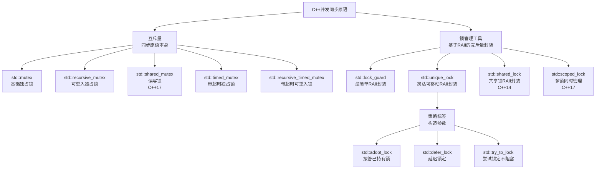
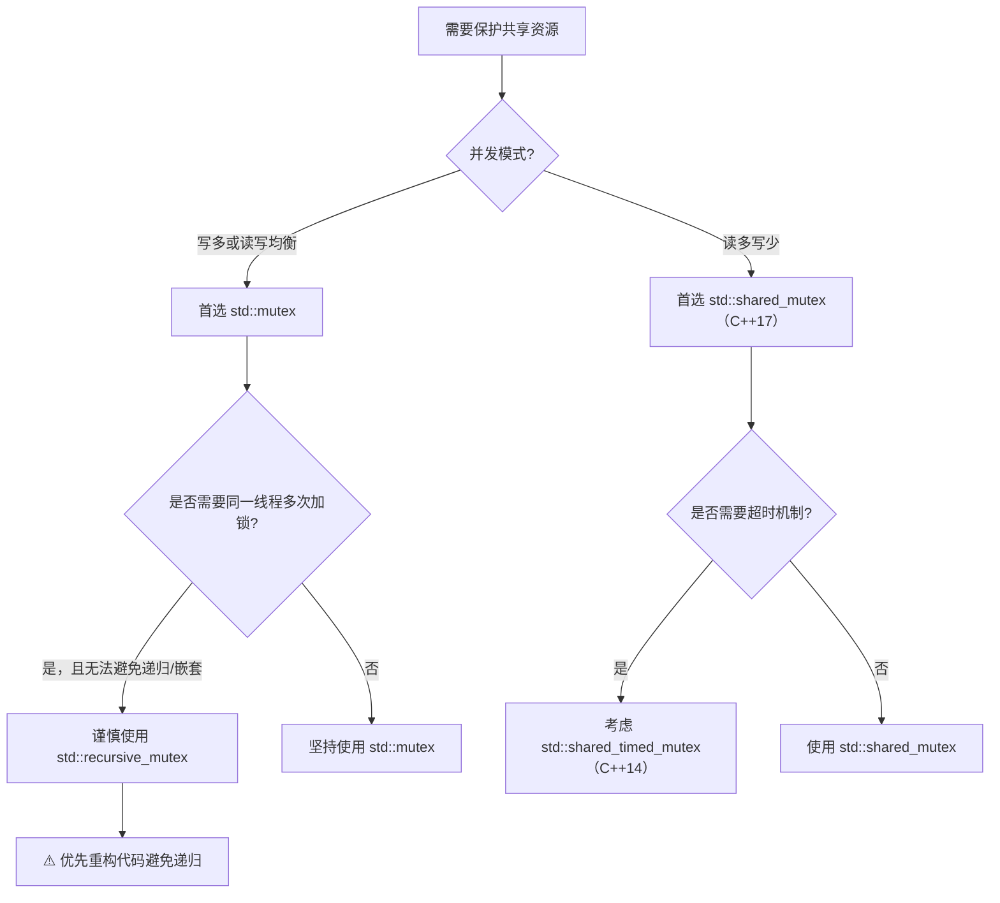
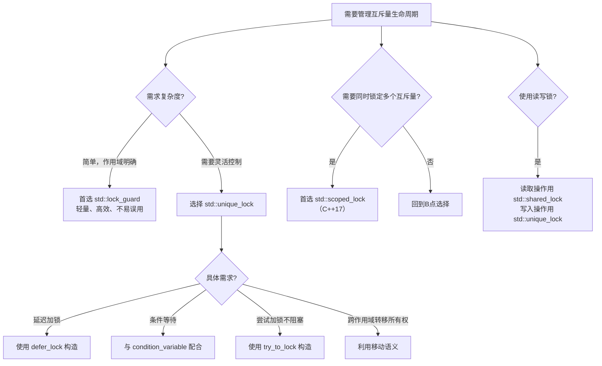

# CPP并发之锁管理工具与互斥量

我将为您系统梳理并对比C++并发编程中的各类锁与互斥量，帮助您清晰理解它们的特性、区别与适用场景。

### 🧭 一、总览：核心类型与关系

首先，通过一个总览表来建立整体框架，理解这些类型如何分类与协作。



此图展示了两大类别：**互斥量**（底层同步原语）和**锁管理工具**（RAII封装），以及它们之间的衍生关系。策略标签是`std::unique_lock`等构造时的行为参数。

---

### 🔒 二、互斥量（Mutex）类型深度对比

互斥量是保护共享资源的底层同步原语，不同类型适用于不同并发模式。

| 特性维度     | `std::mutex`                       | `std::recursive_mutex`               | `std::shared_mutex` (C++17)                              | `std::timed_mutex`                   |
| :----------- | :--------------------------------- | :----------------------------------- | :------------------------------------------------------- | :----------------------------------- |
| **核心语义** | 独占互斥                           | 可重入独占                           | 读写分离                                                 | 带超时独占                           |
| **可重入性** | ❌ 同一线程多次加锁会死锁           | ✅ 同一线程可多次加锁，需对应次数解锁 | ❌ 同一线程重复加共享锁可能抛异常或死锁                   | ❌ 同一线程多次加锁会死锁             |
| **锁模式**   | 仅独占锁                           | 仅独占锁（可重入）                   | 共享锁（多读）+ 独占锁（单写）                           | 仅独占锁                             |
| **性能开销** | 低                                 | 较高（需维护计数和线程信息）         | 中等（状态更复杂）                                       | 高（超时机制开销）                   |
| **典型场景** | 一般互斥保护                       | 递归函数、嵌套调用且需同锁           | **读多写少**场景                                         | 需避免无限等待的场合                 |
| **关键方法** | `lock()`, `unlock()`, `try_lock()` | 同`std::mutex`                       | `lock()`, `unlock()`, `lock_shared()`, `unlock_shared()` | `try_lock_for()`, `try_lock_until()` |
| **C++版本**  | C++11                              | C++11                                | C++17                                                    | C++11                                |

<details>
<summary><b>📖 深入理解：可重入性与递归锁的陷阱</b></summary>
`std::recursive_mutex`允许同一线程多次加锁，这在**递归函数**或**方法间嵌套调用**且需保护同一资源时非常有用。例如：

```cpp
std::recursive_mutex rmtx;
void recursive_func(int depth) {
    rmtx.lock(); // 第一次加锁
    // ... 临界区操作
    recursive_func(depth - 1); // 递归调用，同一线程再次加锁不会死锁
    rmtx.unlock();
}
```
然而，**过度使用递归锁可能掩盖设计缺陷**，如锁职责不清或调用关系混乱。它应被视为“最后手段”，而非常规选择。优先重构代码，简化调用链，使用普通`std::mutex`。
</details>

<details>
<summary><b>📖 深入理解：读写锁（shared_mutex）的性能优势</b></summary>

在读操作远多于写操作的场景（如缓存、配置数据），`std::shared_mutex`能显著提升并发度：
- **多个读线程**可同时持有共享锁（`lock_shared()`），并行读取数据。
- **写线程**必须获取独占锁（`lock()`），此时所有读线程被阻塞，保证数据一致性。

性能测试表明，在8读1写的高并发场景下，`std::shared_mutex`的吞吐量可比`std::mutex`提升**6.5倍**以上。但需注意：写操作仍会阻塞所有读操作，因此写频繁时优势减弱。
</details>

---

### 🛡️ 三、锁管理工具（Lock Guard）类型深度对比

锁管理工具基于RAII原则，在构造时加锁、析构时解锁，避免手动管理导致的死锁。

| 特性维度         | `std::lock_guard`                | `std::unique_lock`                                         | `std::shared_lock` (C++14)                | `std::scoped_lock` (C++17)         |
| :--------------- | :------------------------------- | :--------------------------------------------------------- | :---------------------------------------- | :--------------------------------- |
| **核心设计**     | 最简单RAII，不可移动             | 通用RAII，可移动、可延迟                                   | 共享锁RAII                                | 多锁同时管理RAII                   |
| **加锁时机**     | 构造时**立即**加锁               | 可延迟（`defer_lock`）、尝试（`try_to_lock`）或立即        | 构造时**立即**加共享锁                    | 构造时**立即**按顺序锁定所有互斥量 |
| **手动控制**     | ❌ 不支持手动`unlock()`或`lock()` | ✅ 支持`lock()`, `unlock()`, `try_lock()`                   | ✅ 支持`unlock()`和`lock()`（转独占）      | ❌ 不支持，析构时按逆序解锁         |
| **所有权转移**   | ❌ 不可移动或复制                 | ✅ 可移动（`std::move`），不可复制                          | ✅ 可移动                                  | ✅ 可移动                           |
| **条件变量配合** | ❌ 不支持（无`unlock()`接口）     | ✅ **唯一**可与`std::condition_variable`配合                | ✅ 可与条件变量配合（需转为`unique_lock`） | ❌ 不支持                           |
| **适用锁类型**   | 任何满足`BasicLockable`的互斥量  | 任何满足`Lockable`的互斥量                                 | 仅`std::shared_mutex`及类似               | 任何满足`Lockable`的互斥量组合     |
| **性能/开销**    | **最低**，无状态成员             | 略高，有内部状态（是否持有锁）                             | 中等                                      | 中等（需管理多个锁顺序）           |
| **典型场景**     | **简单**、**作用域明确**的临界区 | 需**延迟加锁**、**条件等待**、**手动控制**或**转移所有权** | 读多写少场景的**共享读取**                | 需同时锁定**多个互斥量**且避免死锁 |

<details>
<summary><b>📖 深入理解：为什么条件变量必须用unique_lock？</b></summary>
`std::condition_variable::wait()`操作要求传入一个**可解锁**的锁对象，因为等待线程在阻塞前必须**临时释放锁**，唤醒后需**重新获取锁**。`std::lock_guard`没有公开的`unlock()`成员函数，无法满足此要求。而`std::unique_lock`提供了`lock()`和`unlock()`接口，并能与条件变量无缝协作：

```cpp
std::unique_lock<std::mutex> lock(mtx);
cv.wait(lock, []{ return ready; }); // 等待前自动解锁，唤醒后自动重新锁定
```
</details>

<details>
<summary><b>📖 深入理解：scoped_lock与std::lock的防死锁机制</b></summary>

当需要同时锁定多个互斥量时，如果各线程加锁顺序不一致，极易死锁。`std::scoped_lock`（C++17）和`std::lock`函数采用**死锁避免算法**（如try-and-back-off），保证要么全部锁定，要么都不锁定，避免部分锁定导致死锁。
```cpp
std::mutex mtx1, mtx2;
// 使用scoped_lock：构造时同时锁定，析构时按逆序解锁
std::scoped_lock lock(mtx1, mtx2); // 安全

// 或手动使用std::lock + adopt_lock
std::lock(mtx1, mtx2); // 先同时锁定
std::lock_guard<std::mutex> lk1(mtx1, std::adopt_lock);
std::lock_guard<std::mutex> lk2(mtx2, std::adopt_lock); // 安全接管
```
`std::scoped_lock`是更现代、更简洁的选择。
</details>

---

### 🏷️ 四、策略标签（adopt_lock, defer_lock, try_to_lock）详解

这些是`std::unique_lock`和`std::lock_guard`构造时的行为策略参数，定义在`<mutex>`中。

| 标签               | 类型            | 含义与行为                                                   | 使用前提与场景                                               |
| :----------------- | :-------------- | :----------------------------------------------------------- | :----------------------------------------------------------- |
| `std::adopt_lock`  | `adopt_lock_t`  | **假设当前线程已持有锁**，构造时不调用`lock()`，仅在析构时调用`unlock()`接管所有权 | **必须先手动`lock()`**成功。常用于`std::lock()`后接管，或跨函数传递已持锁状态 |
| `std::defer_lock`  | `defer_lock_t`  | **假设互斥量未锁定**，构造时不调用`lock()`，初始化为未持有锁状态，可后续手动`lock()` | **不能先`lock()`**。适用于需要延迟加锁，或先做一些非临界操作再锁定的场景 |
| `std::try_to_lock` | `try_to_lock_t` | **尝试获取锁而不阻塞**，构造时调用`try_lock()`，成功则持有锁，失败也立即构造对象（处于未持有状态） | **不能先`lock()`**。适用于不能阻塞的场合，通过`owns_lock()`检查是否成功获取锁 |

**关键示例**：
```cpp
std::mutex mtx;

// 1. adopt_lock：先手动加锁，再让lock_guard接管
mtx.lock(); // 必须先手动加锁
std::lock_guard<std::mutex> lk(mtx, std::adopt_lock); // 构造时不加锁，析构时解锁
// 临界区操作
// lk析构时自动解锁

// 2. defer_lock：延迟加锁，手动控制
std::unique_lock<std::mutex> lk2(mtx, std::defer_lock); // 构造时不加锁
// 做一些不需要锁的操作
lk2.lock(); // 手动加锁
// 临界区操作
lk2.unlock(); // 可手动解锁
// lk2析构时，如果还持有锁会自动解锁

// 3. try_to_lock：尝试加锁，不阻塞
std::unique_lock<std::mutex> lk3(mtx, std::try_to_lock);
if (lk3.owns_lock()) {
    // 成功获取锁，进入临界区
} else {
    // 获取锁失败，做其他处理或等待
}
```

> ⚠️ **重要提示**：使用`adopt_lock`前**必须确保互斥量已被当前线程锁定**，否则析构时调用`unlock()`是未定义行为。使用`defer_lock`或`try_to_lock`前**不能手动加锁**，否则会导致未定义行为。

---

### 🎯 五、选择策略与最佳实践总结

根据具体场景选择合适的工具，是编写高效、安全并发代码的关键。

#### 1. 互斥量选择决策树


#### 2. 锁管理工具选择决策树


#### 3. 黄金法则与避坑指南
1.  **RAII优先**：始终使用`lock_guard`或`unique_lock`管理锁，**绝对避免**手动`lock()/unlock()`。
2.  **最小化临界区**：锁粒度越细越好，只保护真正共享的数据操作，减少锁持有时间。
3.  **避免嵌套锁定**：尽量不在持有一个锁时再去获取另一个锁，必须时需**固定顺序**或使用`std::scoped_lock`。
4.  **优先使用`std::mutex`**：除非明确需要递归或读写分离，否则`std::mutex`是最佳默认选择。
5.  **慎用递归锁**：它可能掩盖设计问题，尝试重构代码而非依赖递归锁。
6.  **条件变量需配`unique_lock`**：这是唯一合法的组合方式。
7.  **注意异常安全**：RAII机制本身保证异常时锁释放，但临界区代码仍需注意。
8.  **考虑无锁替代**：对于简单计数器等，`std::atomic`可能比锁更高效。

> 💡 **核心原则**：选择最简单且满足需求的工具。`std::lock_guard`是首选，当其灵活性不足时再升级至`std::unique_lock`。读写场景优先`std::shared_mutex`配合`std::shared_lock`。多锁场景优先`std::scoped_lock`。

通过以上系统对比，您可以根据并发模式、控制需求和性能考量，为每个具体场景选择最合适的锁与互斥量，构建出既安全又高效的C++并发程序。